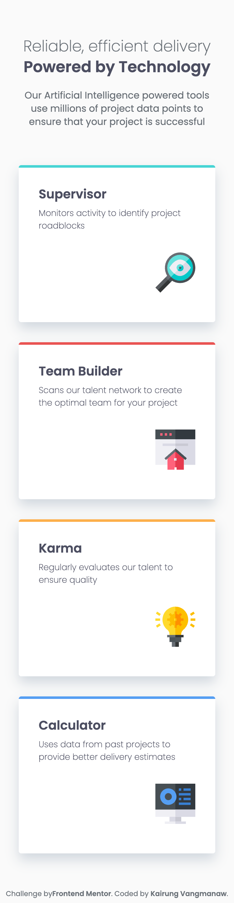
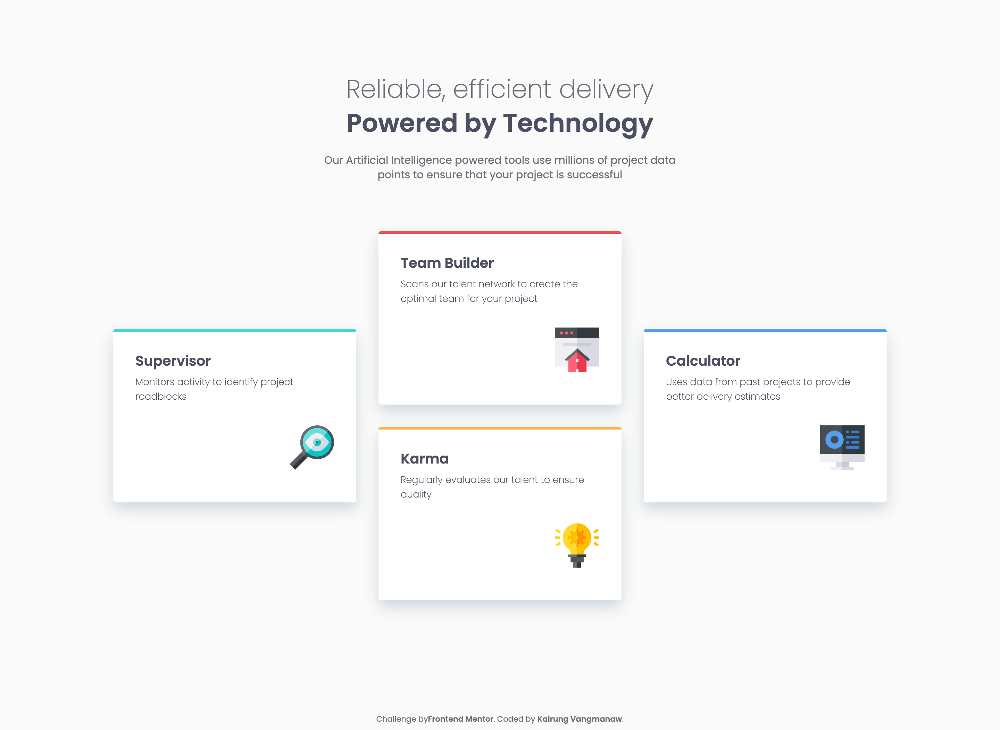

# Frontend Mentor - Four card feature section solution


This is a solution to the [Four card feature section challenge on Frontend Mentor](https://www.frontendmentor.io/challenges/four-card-feature-section-weK1eFYK). Frontend Mentor challenges help you improve your coding skills by building realistic projects. 

## Table of contents

- [Frontend Mentor - Four card feature section solution](#frontend-mentor---four-card-feature-section-solution)
  - [Table of contents](#table-of-contents)
  - [Overview](#overview)
    - [The challenge](#the-challenge)
    - [Screenshot](#screenshot)
    - [Links](#links)
  - [My process](#my-process)
    - [Built with](#built-with)
    - [What I learned](#what-i-learned)
    - [Continued development](#continued-development)
    - [Useful resources](#useful-resources)
    - [AI Collaboration](#ai-collaboration)
  - [Author](#author)
  - [Acknowledgments](#acknowledgments)

## Overview

### The challenge

Users should be able to:

- View the optimal layout for the site depending on their device's screen size

### Screenshot

<details>
  <summary>Mobile view</summary>
  
</details>

<details>
  <summary>Desktop view</summary>
  
</details>

### Links

- Solution URL: [Four card feature section with React, BEM CSS, and CSS Grid](https://www.frontendmentor.io/solutions/four-card-feature-section-page-with-react-sass-and-grid-component-lbOi_UHBXY)
- Live Site URL: [Frontend Mentor | Four card feature section](https://challenged-by-frontend-mentor.github.io/four-card-feature-section/)

## My process

### Built with

- [Semantic HTML5 markup](https://developer.mozilla.org/en-US/docs/Glossary/Semantics) - Using `<main>`, `<header>`, `<section>`, `<article>`, and `<footer>` elements
- [CSS Custom Properties](https://developer.mozilla.org/en-US/docs/Web/CSS/Using_CSS_custom_properties) - For managing design tokens (colors and typography)
- [Flexbox](https://developer.mozilla.org/en-US/docs/Learn/CSS/CSS_layout/Flexbox) - Used for header centering and card internal layouts
- [CSS Grid](https://developer.mozilla.org/en-US/docs/Web/CSS/grid-template-areas) - Utilizing `grid-template-areas` for clean 4-card desktop placement
- [Mobile-first workflow](https://developer.mozilla.org/en-US/docs/Meaning_of_mobile_first) - Responsive design starting from mobile screens
- [BEM Methodology](https://getbem.com/) - Block Element Modifier class naming strategy
- [React](https://react.dev/) - JS library for component-based UI
- [Vite](https://vitejs.dev/) - Next Generation Frontend Tooling

### What I learned

Working on this challenge helped me refine both my CSS architecture and accessibility standards:

1. **CSS Grid Areas for Unique Layouts:** Using `grid-template-areas` made creating the asymmetric 3-column "four card" desktop layout significantly cleaner than using complex floating or flex math.

2. **Accessible Decorative Media:** Ensured that decorative SVG icons inside cards do not clutter Screen Readers by combining empty `alt=""` attributes with `aria-hidden="true"`.

3. **Clean Page Root Architecture:** Refactored top-level layout styles to target the `#root` element instead of `:root`, keeping the DOM tree flat and maintaining a proper React component wrapper structure.

```css
/* Clean layout area distribution using grid-template-areas */
.feature-cards {
  display: grid;
  grid-template-areas:
    "cyan"
    "red"
    "orange"
    "blue";
  gap: 32px;

  @media (min-width: 1024px) {
    max-width: 1116px;
    grid-template-areas:
      "cyan red blue"
      "cyan red blue"
      "cyan orange blue"
      "cyan orange blue";
  }
}
```

### Continued development

In future projects and updates, I plan to focus on:

- **Advanced Fluid Typography & Spacing**: Continuing to practice finding the ideal balance between fixed pixel values and fluid units like clamp() across diverse breakpoints.

- **Micro-interactions**: Adding subtle entry animations or hover transitions to make the cards feel more interactive.

- **Expanded Accessibility Testing**: Testing with real Screen Readers (such as VoiceOver or NVDA) to verify landmark clarity and heading navigation flow.

### Useful resources

- [Clamp Calculator](https://clampcalculator.com/) - Essential utility for calculating fluid CSS clamp() values cleanly.

- [Atmos RGB to HSL Converter](https://atmos.style/color-converter/rgb-to-hsl) - Handy converter for managing consistent HSL color variables in CSS.

### AI Collaboration

Throughout this project, I collaborated with Google Gemini and Google Search AI Mode as technical reviewers:

- **Code Auditing & Accessibility**: Used AI to review Semantic HTML hierarchy, verify WCAG accessibility guidelines (`aria-hidden`, landmark labels), and ensure proper BEM class naming.

- **Architecture Validation**: Verified React container structure and CSS Grid layout strategies to ensure code cleanliness.

## Author

- GitHub: [Kairung Vangmanaw](https://github.com/VangmanawKairung)
- Frontend Mentor - [@VangmanawKairung](https://www.frontendmentor.io/profile/VangmanawKairung)

## Acknowledgments
I would like to express my sincere gratitude to:

- **Myself**: For pushing through challenges, staying dedicated to continuous learning, and never giving up.

- **My Family**: For their constant support and encouragement throughout my journey.

- **Frontend Mentor**: For creating well-designed, realistic challenges that help developers sharpen real-world skills.

- **Native Developer Utilities**: Special thanks to macOS Preview—inspecting design mockups directly to extract exact pixel measurements allowed me to build the layout much faster and avoid unnecessary trial and error.

- **Tools & Ecosystem**: Thanks to VS Code, Git, GitHub, and Google for providing free, powerful AI tools like Gemini that make learning and building modern web applications smoother.